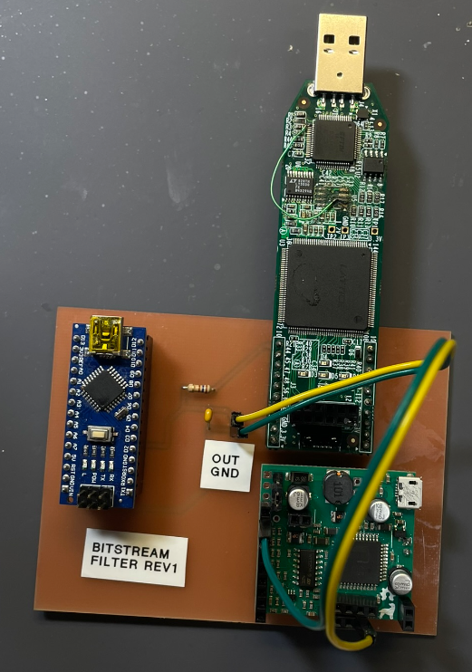
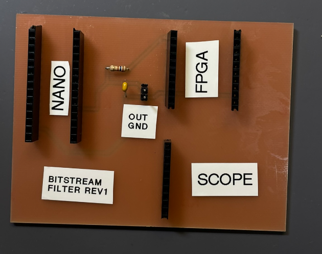
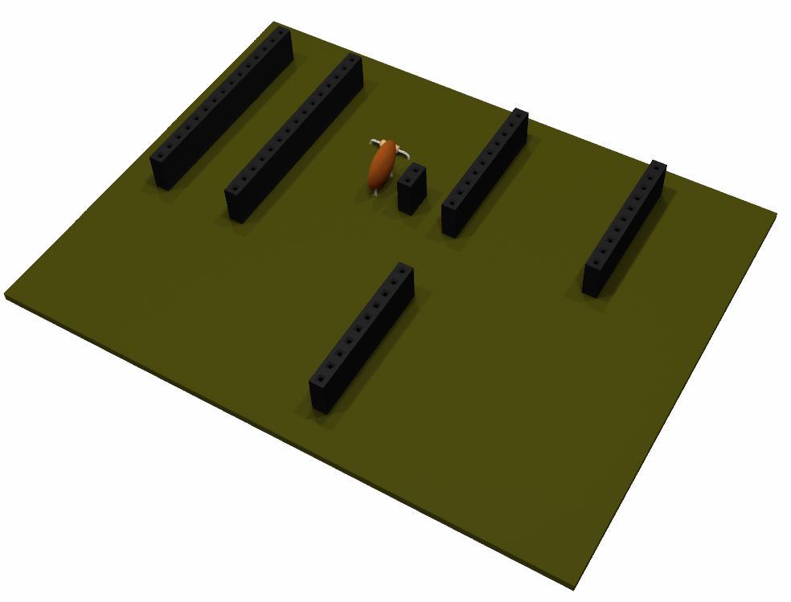
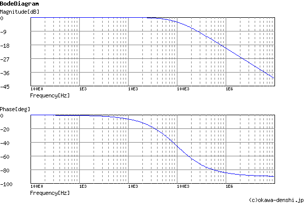
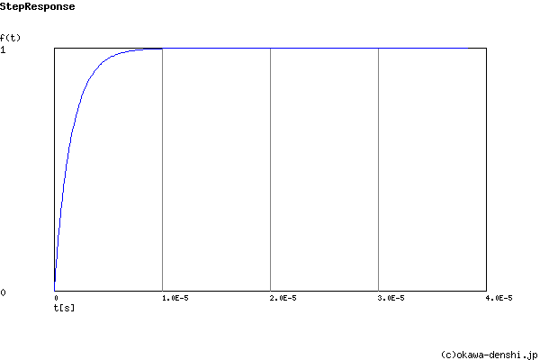
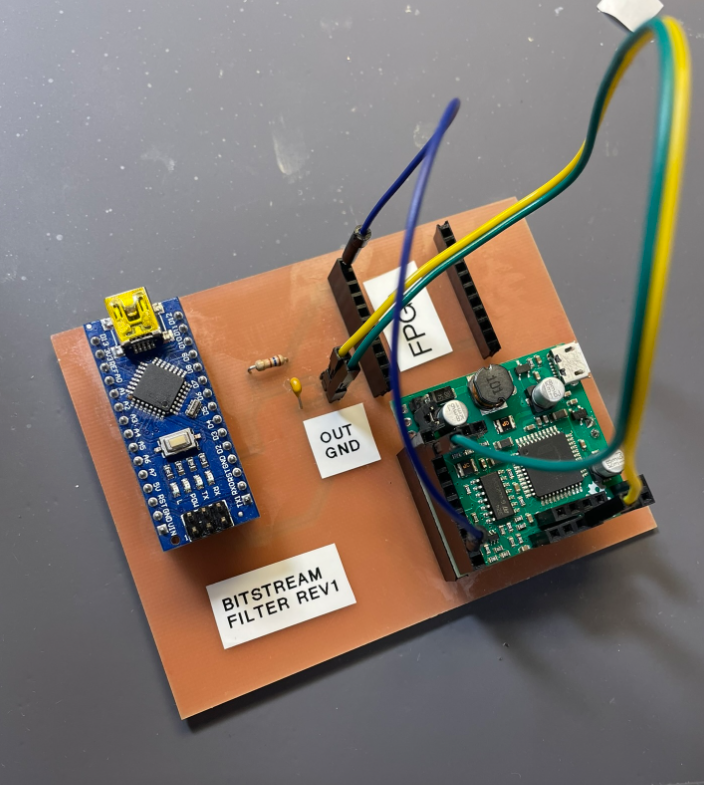

# Bitstream-Evolution-FilterBoard
Logan Manthey Spring 2023-2024

<!-- markdown-toc start - Don't edit this section. Run M-x markdown-toc-refresh-toc -->
**Table of Contents**

- [Bitstream-Evolution-FilterBoard](#bitstream-evolution-filterboard)
    - [Purpose](#purpose)
    - [Use](#use)
        - [Scope](#scope)
        - [Ardunio Nano](#ardunio-nano)
    - [Filter](#filter)
        - [Testing the Filter](#testing-the-filter)
            - [Results of the Filter Plus Software Modifications](#results-of-the-filter-plus-software-modifications)
    - [BOM](#bom)
    - [Future Work](#future-work)
        - [Notes for Next Revisions](#notes-for-next-revisions)
            - [FPGA Header Placement](#fpga-header-placement)
            - [Through Hole Parts](#through-hole-parts)
    - [Current Timeline](#current-timeline)

<!-- markdown-toc end -->

## Purpose
This board is a simple header board to be able to mount an FPGA, Ardunio Nano Microcontroller, and as ESPOtek Labador to it. This board also includes a basic passive low pass filter which will filter measurements on the ardunio to be more accurate to what we can accurately gather it will also ensure consistency with how we are gathering measurements as well. This PCB also allows us to test fit headers for future boards to build as well. 

|  | 
|:--:| 
| *Populated PCB* |

|  | 
|:--:| 
| *Unpopulated PCB* |

|  | 
|:--:| 
| *PCB Render* |

## Use

### Scope
The following scope was used in this project. To find further documentation about both software and how to use the scope take a look at this link.
[EspoTek Link](https://espotek.com/labrador/)

### Ardunio Nano
Given this board has some filtering on it there needs to be some slight modification to the ReadSignal.ino file that has been used in the past. These modifications include filtering out values which are outside of the range of testing. To start I had this value just at 10K so basically filtering out any values below 10K which would include both values beyond what the nano can read and some that the nano can read. This will ensure that the only values sent back to the computer will be accurate values. Further testing to adjust this value may be required and will be updated in later revisions. See the below section [Testing the Filter](### Testing the Filter) for more infomation about finding this value.

## Filter
The filter used has a 160 ohm resistor and a 0.01 uF capacitor this gives a -3dB cutoff frequency of 99471.8394 Hz. In testing at 3.3 volts this will give us an accurate interrupt reading range on the ardunio of between 10kHz and 60Khz with only some aliasing around the 55kHz to 60Khz range. This is much better than not using as there will be aliasing anywhere above about 100kHz whereas this will simply just filter those values out. Though this is an extremly simple filter it will allow us to ensure that our measurements we are getting are in a certain measureable range while still maintaining affordability. During some initial testing of this I found that the max value we could accurately measure with the interrupt counter was at about 60Khz.

|  | 
|:--:| 
| *Bode Plot* |

|  | 
|:--:| 
| *Step Response* |

### Testing the Filter
To test the filter the following configuration on the board was used. 

|  | 
|:--:| 
| *Filter Testing Setup* |

In short the signal generator was connected to the port where the FPGA signal is normally coming from and this is then connected to the ardunio nano through the PCB as normal. The scope section was connected as normal as well to monitor the filter.

#### Results of the Filter Plus Software Modifications

## BOM

| Part                        | Quanity |
| --------------------------- | ------- |
| 160 Ohm Resistor            | 1       |
| 0.01 uF Capacitor           | 1       |
| 10 Pin 2.54mm Female Header | 3       |
| 15 Pin 2.54 Female Header   | 2       |

## Future Work

### Notes for Next Revisions
#### FPGA Header Placement
Due to measuring with a ruler the pin placement is less than ideal. Getting better measurements using a caliper instead should fix this in the next revision. 

#### Through Hole Parts
I wasn't quite a fan of how the through hole parts fit with the footprints that I had. This isn't a huge issue but may want to fix for the next revision of this board.     

## Current Timeline
This board is a part of a series of more iterative and rapid prototyping boards rather than a complete all encompassing board. This is the first in that series which is meant to test the specifics of the pulse count experiment. 

- [x] Revision 1
- [ ] Revision 1.1
  - Fix FPGA Header Placement

